<h1 align="center">Hi, I'm Joel Chavez (JhoZzel)</h1>
<h3 align="center">Computer Science student focused on algorithms, competitive programming, and AI.</h3>

  <a href="https://www.linkedin.com/in/joel-chavez-chico/">LinkedIn</a> •
  <a href="https://codeforces.com/profile/jhozzel_">Codeforces</a> •
  <a href="https://atcoder.jp/users/JhoZzel">AtCoder</a> •
  <a href="https://leetcode.com/u/JhoZzel/">LeetCode</a> •
  <a href="https://clist.by/coder/JhoZzel/">CLIST</a>

---

### About me

- Computer Science student
- Competitive programmer passionate about algorithms and problem solving
- Interested in data structures, graphs, optimization, and AI
- I use this GitHub to share projects, notebooks, and contest templates

---

### Competitive Programming

I actively participate in online judges and contests across different platforms.  
You can find my aggregated profiles, ratings, and teams here:

  

  

  

---

### GitHub Stats

  
  

  

